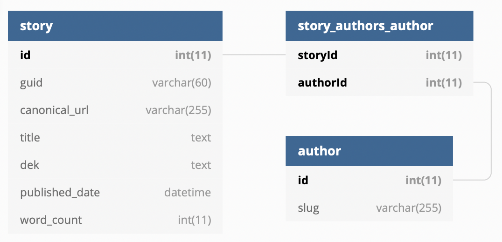

# Syndication service

This is a simple API that accepts syndicated stories and adds them to a MariaDB
database.

- If the story already exists (same ID), it will update it in place.
- If the story provides a URL that we’ve already seen, but with a different ID,
  it will be considered a bad request (`400`).

## Run

A `docker-compose` setup is provided and recommended to run the API:

```sh
docker-compose up -d
```

This builds the project and makes a web server available at
[localhost:3000](http://localhost:3000/). Note that the database may take up to
a minute to be ready.

There’s no hot-reloading, so if you make changes to the application, you’ll need
to do the following to rebuild the project:

```sh
docker-compose down
docker-compose build
docker-compose up -d
```

## Use

Here’s an example request:

```sh
curl -X POST -d @./tests/__fixtures__/exampleFromPDF.json -H 'Content-Type: application/json' http://localhost:3000/stories/
```

In addition, you can retrieve stories that have been added:

```sh
# Get all stories
curl http://localhost:3000/stories/

# Get a story by its (internal) ID
curl http://localhost:3000/stories/1
```

## Run tests

The tests are end-to-end, so first make sure the `docker-compose` stack is
running:

```sh
docker-compose up -d
```

You will need to install the dependencies locally, if you haven’t already:

```sh
npm install
```

Then run the tests:

```sh
npm test
```

The database will not be immediately available, so the first test run might take
a minute to start up.

Tests are run with Jest (well, actually `ts-jest`). I chose end-to-end testing
because I had a rig handy and because there is a lot of confidence already
provided by the type-safe ORM. It seemed like testing the HTTP layer itself
might be the best use of time. With more time, I would have also written unit
tests.

## Database schema

TypeORM does a pretty good job of providing readable code representation of the
schema, but here is an ERD:



Note that because the provided IDs are external, I did not use them as the
primary key, instead storing them as `guid`. I created separate tables for
authors and their relationships to stories. With more time I would have done the
same for tags and art.

## Checklist

> This task is complete when:

- ✅ A user can post JSON (that matches the given schema in the example) to your
  API endpoint.
- ✅ Your application parses the JSON and saves it to the database.
  - ✅ JSON containing a unique id and a unique canonical_url is added to the
    database as a new entry.
  - ✅ JSON containing id and canonical_url values that match an existing entry
    is handled as an update to an existing entry with the new content.
- ✅ You have documented the database schema.
- ✅ You have provided instructions describing the process to setup/install any
  prerequisite software, initialize the relational database, and run the web application.

> Extra points will be awarded for:

- ✅ A full git history showing your development style.
- ⚠️  Irregularity detection and alerting (for instance, if a record with a new
  id is posted with the same canonical url as an existing record).
- ✅ Read endpoint(s).
- ⚠️  Tests.
- ✅ Dockerization of application.

## With more time...

I did some minor irregularity detection, but would have liked to do much more,
with unit test coverage. ”Alerting” is an interesting choice of words. I’m
logging errors, but could do much more here to make sure that errors are
regularly formatted and primed for monitoring.

I added end-to-end tests, which provide coverage for the core use cases, but
could be more extensive—especially more fixtures with different kinds of updates
and diversity of data. Unit tests are also needed to increase coverage,
especially at the controller level.

I would have also liked to spend time thinking about how this application would
be deployed and how to improve the development experience (hot-reloading and
linting come to mind).

I also have to admit that while I completed the actual coding within 3 hours, I
spent close to an additional hour on this `README`. I consider communication and
documentation to be an essential part of engineering, so technically I exceeded
the time limit. I also benefited from having some pieces lying around from other
projects that I could put to use; without those resources I would not have
gotten as far.

## Thanks!

Thanks for reading! This was a fun project, I’m sad it’s over.
